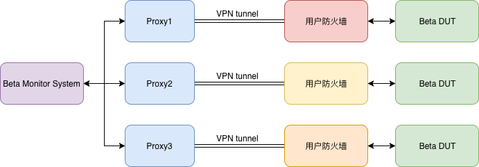
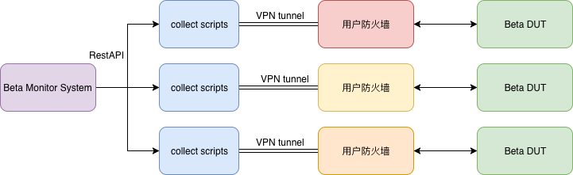

# Beta Monitor系统设计- V2

## 背景介绍

Beta Monitor第一个版本发布，经历了从无到有的一个过程。从项目建立之初，我们就提出了Beta Monitor系统期望实现的功能

- 设备管理
- Beta设备信息收集
  - 设备状态
  - license状态
  - 是否有coredump
  - CPU使用状况
  - 内存使用状况
  - 会话数
  - 日志收集
- 邮件通知
- 日报系统
- 报表
- 用户认证
- 威胁分析

在第一阶段，我们已经完成了：

1. 设备管理
2. 项目管理
3. 部分信息收集及邮件通知

然而，我们始终面临一个问题，那就是外部的beta点很多都是不能够直接访问，而需要客户提供的VPN才能进行访问。这是我们当前的系统无法实现的。

为了能够将更多的设备纳入监控行列，需要对整体的架构进行调整。

## 系统依赖

由于已经拥有HBB框架进行设备连接及处理命令（这包括：CLI，Shell，RestAPI），不同的产品也已经开发了比较完备的库，可以节省很多人力

## 方案比较

不同的客户，可能使用不同的VPN，这就使得我们无法用一台机器来运行所有的VPN，那么，有以下两种方案可供选择

### 代理方案

#### 方案说明

代理方案即将不同的VPN分别安装在不同的PC上，并在对应的PC上开启代理服务器，由beta monitor系统发起连接，经过代理转发到对应的设备上

#### 方案优缺点

1. 对当前系统整体架构改动不大
2. 原有的ssh/telnet可能无法通过代理方式访问设备
3. 收集脚本需要使用REST API方式获取所有信息，是否当前需要的信息都可以通过REST API获取
4. 无法获取shell下的内容，如coredump、数据库信息等

### 分布式方案

#### 方案说明

分布式方案则是通过将收集脚本运行在安装有VPN客户端的PC上，而对于beta monitor系统而言，有两种方式收集信息

1. 收集脚本定时收集信息并主动上送
2. beta monitor系统通过某种方式（如Rest API），远程调用收集脚本运行，并收集相应的信息

#### 方案优缺点

- 主动上送方案

1. 收集脚本与当前基本一致
2. 仅结果记录时，需要远程访问beta monitor的数据库用以记录
3. 脚本一旦运行，将不受Beta Monitor系统控制

- 远程调用方案

1. 收集脚本与当前基本一致
2. 需要开发一个额外的的Rest API服务器或socket服务器，负责信息处理

> 无论是主动上送方案，还是远程调用方案，都需要HBB支持在Windows上运行

