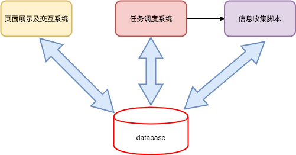
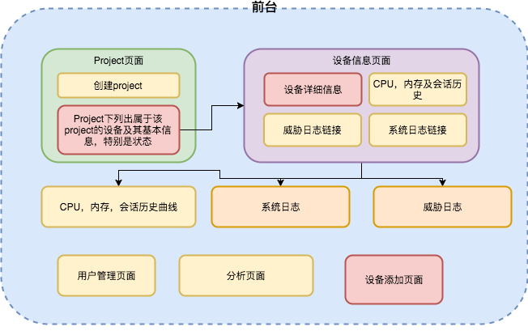
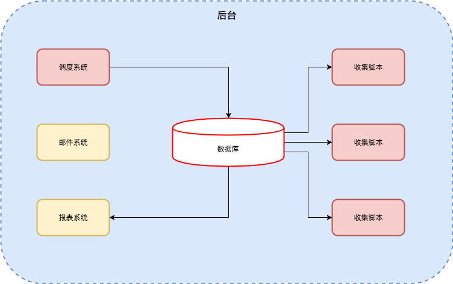
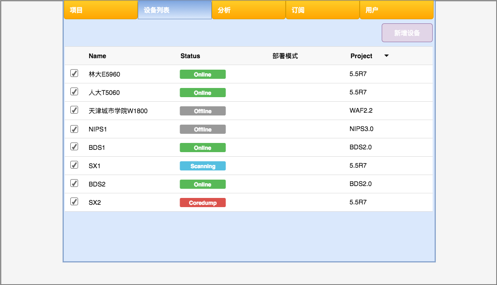
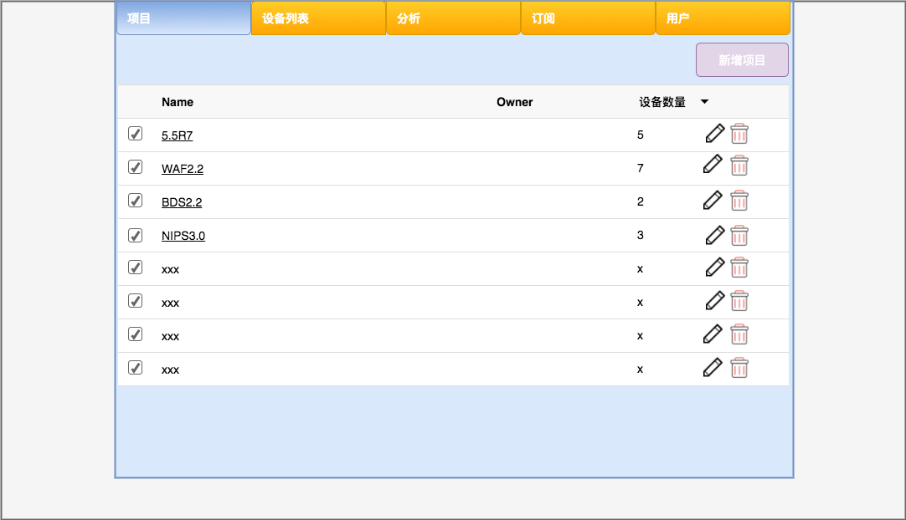
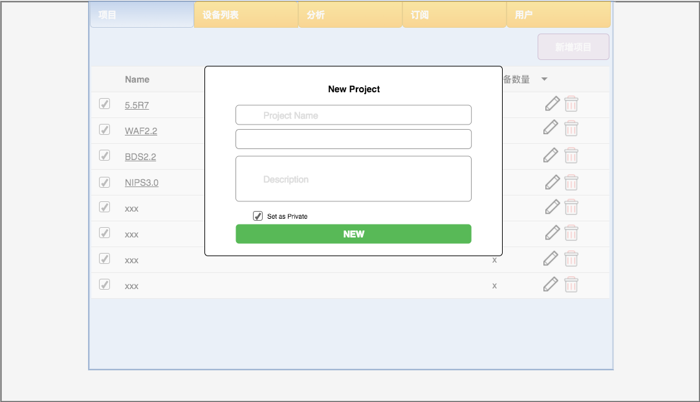
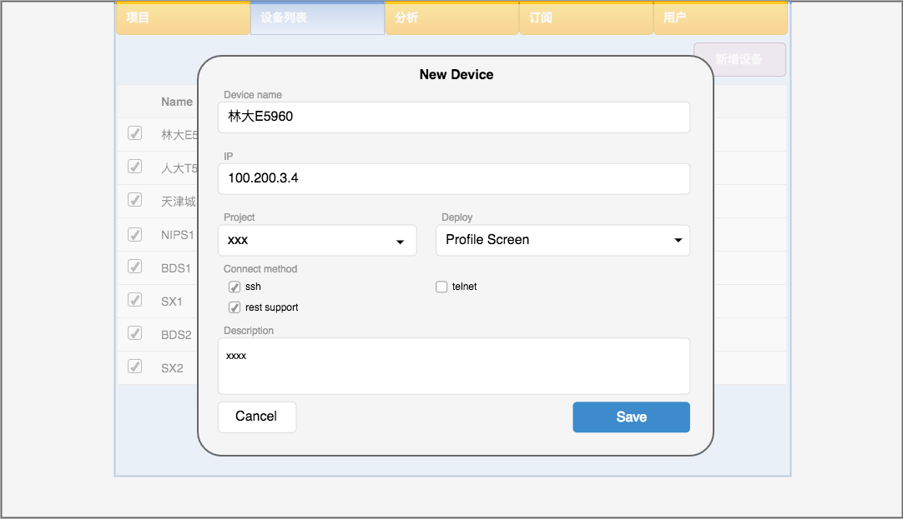
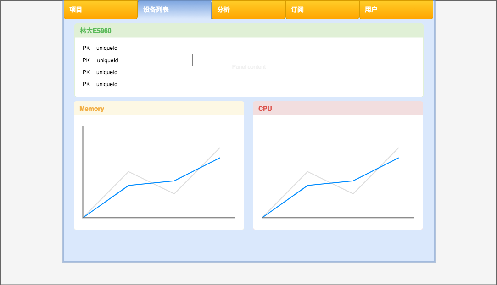

# Beta点信息收集及分析系统

[TOC]

### 需求说明

每次版本发布，都需要有相应的beta点用来做beta测试。而经历一段时间后，beta点是否状态正常，beta点从什么时候开始异常，以及更多的威胁分析等工作，都需要很多人力去完成。

另一方面，从练习python的角度，我们希望用一个实际的项目来提高大家的python技能。

### 阶段说明

本系统将分为四个阶段来完成

1. Beta设备信息收集及基本状态定期检查
2. Beta点日报
2. 威胁分析
3. 界面美化

第一阶段我们将关注

1. Beta设备录入，删除
2. Beta设备基本信息收集
3. Beta设备状态检查
4. Beta设备日志收集并存储

### 基础知识

1. StoneOS基础操作
2. pexpect
3. flask

### 主要功能
#### Beta设备管理

##### 功能描述

1. 设备录入
2. 设备信息展示
3. 设备删除
4. 设备信息更改（可选）

##### 设备信息说明（数据库表）

`hs_beta_project`表结构

id | name | ower
--- | --- | ---
1 | 5.5R6 | bqi@testsite.com

`hs_beta_devices`表包含

id | name | description | ip | ssh | Telnet | rest | project_id | deploy
--- | --- | --- | --- | --- | --- | --- | --- | ---
1 | TJ_E6360 | 天津城市学院设备 | 222.10.10.10 | Y | Y | Y | 1 | tap
2 | 林大T5060 | 林业大学 | 222.11.11.11 | Y | N | N | 1 | in_line

##### 操作说明

1. 设备ID自动生成
2. 设备名称为可选，可自动生成名称
3. 设备描述为可选，可为空
4. 设备IP为必选
5. ssh, http, rest为check_box
6. project_id为必选项，来源从`hs_beta_project`表中获取
7. deploy为可选

#### 设备基本信息收集及展示

##### 功能描述

设备基本信息收集是为设备状态检查提供数据的。将使用可用的连接方式连接设备并定期收集设备信息。这些信息将包含设备是否在线，启动时间，版本信息，CPU使用状况，内存状况，是否有coredump，当前session统计等

##### 设备信息说明（数据库表）

`hs_beta_device_base_info`表包含

id | dev_id | start_time | version | cpu | mem | active | session | status
--- | --- | --- | --- | --- | --- | --- | --- | --- 
1 | 1 | 1920392123 | 5.5R5P1 | 14 | 60 | Y | 223344 | online
2 | 5 | 124275102 | 5.5R6 | 0.1 | 10 | N | 100 | online

同时，为了方便分析，需要存储CPU，内存，session等信息到相应的表中

设备状态定义：

* 设备首先具有Beta阶段和非Beta阶段
  * Beta阶段即当前设备处于Beta版本测试阶段
  * 非Beta阶段则表示该设备当前不在beta，但设备在客户机架上
* 设备状态则包括
  * Online： 设备在线
  * Offline： 设备离线
  * Scanning：正在扫描
  * Coredump：设备在线但设备上有coredump

`hs_beta_dev_cpu`

id | dev_id | time | cpu 
--- | --- | --- | ---
1 | 1 | 192837492 | 14
2 | 1 | 129378235 | 20
3 | 5 | 196487249 | 100

`hs_beta_dev_mem`

id | dev_id | time | mem
--- | --- | --- | ---
1 | 1 | 11111111 | 100
2 | 2 | 22222222 | 50

`hs_beta_dev_sess`

id | dev_id | time | mem
--- | --- | --- | ---
1 | 1 | 11111111 | 2222

##### 页面显示

* 基础信息展示页面

    1. 设备名称
    2. 版本信息 
    3. 在线状态
    4. 是否有coredump
    5. 更新时间

* 详细信息展示页面

    1. 可展示最新一周/一天的cpu历史变化曲线
    2. 可展示最新一周/一天的内存占用曲线
    3. 可展示最新一周/一天的session数量曲线

#### 日志收集

##### 功能描述

负责收集设备上的日志，包括系统日志和威胁日志，并可按照设备进行展示

##### 信息说明（数据库表）

为每一个设备创建两张表，分别为`hs_beta_$id_syslog`和`hs_beta_$id_threatlog`

`hs_beta_id1_syslog`

id | time | level | log
--- | --- | --- | ---
1 | 1922948821| INFO | info@This is a test log 
2 | 1283721751 | CRIT | CRIT@this is a critical log

`hs_beta_id1_threatlog`

id | time | level | log
--- | --- | --- | ---
1 | 1284282929 | INFO | this is a test log for threat
2 | 2472812491 | CRIT | this is a test log for threat

##### 日志展示

在每个设备的信息展示页面，分别增加系统日志和威胁日志两个按钮，点按之后，可展示最近一天的日志信息

### 底层设计

#### 主要内容

鉴于HBB已经有较为完整的连接设备的解决方案，那么使用的getDevice方法来实现信息收集功能，则信息收集为一个脚本，可以单独运行。那么需要一个简单的调度系统，并且需要一系列数据库来支持。

调度系统负责下发系统命令从而执行信息收集，那么，整个信息收集系统成为一个可并行的系统。

`hs_beta_current_task`

该表用以支持当前运行的任务状态

id | start_time | update_time | status | device_id | pid
--- | --- | --- | --- | --- | ---  | --- 
1 | 1928284829 | 1824282942 | pending | 11 | 19284
2 | 1928491249 | 2828219284 | running | 12 | 12428
3 | 1924282192 | 1248292882 | finished | 21 | 19274

`hs_beta_task_history`

该表用以存储历史任务

id | start_time | end_time | result | device_id
--- | --- | --- | --- | --- 
1 | 19284292981 | 1928381284 | pass | 1
2 | 12481287852 | 1928949182 | fail | 1

`hs_beta_task_device`

该表用以存储当前设备上的任务状态

id | device_id | task_id
--- | --- | ---
1 | 11 | 111
2 | 12 | 222
3 | 13 | null

#### 实现逻辑

系统分为两部分，调度系统和收集脚本

##### 调度系统实现

##### 获取信息脚本

### 前台

#### 页面及数据库表对应关系

页面 | 对应数据库表 | 说明
--- | --- | --- 
project页面 | hs_beta_project, hs_beta_devices, hs_beta_device_base_info | 
设备信息页面 | hs_beta_devices, hs_beta_device_base_info, hs_beta_device_cpu, hs_beta_device_mem, hs_beta_device_session |
设备添加页面 | hs_beta_devices |

#### 页面构成

##### Project页面

包含属于该project的设备信息列表

设备状态 | 设备名称 | 设备IP | 部署模式 | 设备描述
--- | --- | --- | --- | ---
~~Online~~ | ~~林大E5960~~ | ~~111.222.33.44~~ | ~~tap~~ | ~~林业大学Beta点设备~~ 
~~Offline~~ | ~~人大T5060~~ | ~~22.33.44.55~~ | ~~inline~~ | ~~人大beta点设备~~ 

##### 设备详细信息页面

包含该设备的所有信息

key| value | detail
--- | --- | ---
设备名称 | 林大E5960 |
版本信息 | 5.5R5P2 | 
S/N| 1234567890 |
产品名称 | SG6000-W1800 |
部署模式 | 旁路 |
设备IP | 22.33.44.55 | 
连接方式 | ssh, http, rest |
设备状态 | online | 
启动时间 | 2018.8.1 10:10:10 | 
更新时间 | 2018.8.8 22:22:22 |
是否有coredump | 是 |
CPU | 100% | ==history== 
内存 | 90% | ==history== 
会话数 | 456789 | ==history== 

##### 设备添加页面

包含设备的基本信息

key | value | 说明
--- | --- | ---
设备名称 | 林大E5960 | 必选
设备IP | 111.222.33.44 | 必选
连接方式 | [ x] ssh |可能要支持自定义端口
| [ ] http | 可能要支持自定义端口 
| [ ] rest |
部署模式 | tap |下拉选择
owner | bqi |
Project | WAF2.2 | 下拉选择
description | This is a beta device for Linda | 

### 后台

#### 子系统说明

##### 调度系统

定期查看数据库中的任务列表，调度运行各个收集脚本

##### 收集脚本

脚本分为两部分

1. 仅查看设备状态，包括版本，cpu，内存，会话数，coredump，平台license状态，是否在线等
2. 收集详细信息脚本，包括系统日志，威胁日志，license信息

按照设备不同，会有不同的收集脚本，被调度系统调度执行，可接受参数

##### 报表系统（可选）

分析设备日志并产生报表

##### 邮件系统（可选）

用来通知相关的owner，设备离线或设备出现coredump进行通知

支持他人订阅，即收件人为一个列表

同时，需要为每个设备创建订阅表

##### 订阅系统（可选）

订阅系统主要用于设备状态异常后通知相关人员，或者用于报表订阅。

默认情况下，每一个设备都应该有一个Owner，该owner默认将订阅该设备的状态。当设备状态异常时，需要及时以邮件形式通知设备的订阅者。

另一方面，在后面的阶段中，可定期自动产生报表，并发送给相关订阅者。

##### 数据库系统

使用mysql数据库

##### 用户系统

当设备过多后，可能需要用户管理系统，谁有权限添加设备，谁有权限订阅设备及执行报表等，可以使用用户系统

> 最终的实现亦可以打包成docker的image

### 相关页面设计

#### 主页

打开页面将进入设备列表页面

点击设备名称的链接，将跳转到[设备详细信息页面](#设备详细信息)

#### 项目及新建项目

点击项目名称链接，跳转到[设备列表页面](#主页)，显示该项目的所有设备

#### 新增设备页面

#### 设备详细信息

设备详细信息中提供三个链接，分别是获取coredump，查看系统日志，查看威胁日志，点击日志，会跳转到分析页面

#### 后台

1. 调度&任务子系统（Bo，yue)
2. 收集脚本（参数）(lintao)
3. 邮件(YiLian)
4. 订阅子系统（可选）(junbo)

#### 前台

1. 项目管理(jiangxi)
2. 设备管理(xuqian)
3. 设备信息总览页面（xingyu，Lei）
4. 设备详细信息（xingyu，lei）
5. 数据库（yue，bo）
6. 订阅页面（junbo）
7. 框架（lei）

