# beta-monitor简介

我们每次版本发布前，都需要有相应的beta点来做beta测试。而经历一段时间后，beta点是否状态正常，能否正常登录，何时开始异常，license状态，以及更多的威胁分析等工作，需要很多人力去完成。

Beta-monitor系统是一个可以统一监控并管理beta点状态的系统，它监测beta点的状态，当beta点出现异常时，设备状态将会显示为offline或alarm。同时，你可以查看到beta点设备的详细信息和CPU、Memory、Session趋势图详情。

后续我们将不断完善该系统，增加用户系统、威胁分析、邮件功能（当设备状态异常时，发送邮件给Owner）、订阅功能等模块。

# beta-monitor安装和使用

### 环境准备

Beta-monitor系统基于python2.7开发，建议运行在ubuntu，目前Beta-monitor在该操作系统上实现和测试，能够保证可以正常使用。

除此之外还需要安装下面软件：

* __mysql-server：__ sudo apt-get install mysql-server-5.6（root用户的密码任意，这里设置为beta）
* __MySQLdb：__ sudo apt-get install python-mysqldb
* __python-dev：__ sudo apt-get install python-dev
* __libmysqld-dev：__  sudo apt-get install libmysqld-dev
* __libmysqlclient-dev：__  sudo apt-get install libmysqlclient-dev


### 下载安装

1. 从git-lab clone到本地

    ```
    git config --global http.sslVerify false
    git clone -b 1.0 https://beta.testsite.com/ppg/beta-monitor.git
    
    ```
2. 安装HBB2.0框架和其他python依赖库,建议在virtualenv虚拟环境安装
    ```
    pip install git+https://beta.testsite.com/hbb2/hbb-core.git@latest
    cd beta-monitor
    pip install -r requirements.txt
    ```
    
2. 创建mysql beta用户、beta_monitor数据库，并为beta用户授权

    ```
    root@beta-HVM-domU:/home/beta/beta-monitor# mysql -uroot -pbeta

    mysql> CREATE USER 'beta'@'%' IDENTIFIED BY 'beta';
    Query OK, 0 rows affected (0.00 sec)

    mysql> create database beta_monitor;
    Query OK, 1 row affected (0.00 sec)

    mysql> show databases;
    +--------------------+
    | Database           |
    +--------------------+
    | information_schema |
    | beta_monitor       |
    | mysql              |
    | performance_schema |
    +--------------------+
    4 rows in set (0.00 sec)

    mysql> GRANT ALL ON *.* TO 'beta'@'%';
    Query OK, 0 rows affected (0.00 sec)

    ```
3. 创建/更新数据库表

    ```
    alembic upgrade head
 
    ```


### 部署、启动

beta-monitor系统需要同时执行app/目录下的betaTask.py和app.py才能够运行, 提供几下几种部署启动方式：

##### 利用flask自带的web server简单部署

1. 在beta-monitor目录下直接执行supervisord -c supervisord.conf即可

    ```
       root@beta-HVM-domU:/home/beta/beta-monitor#supervisord -c supervisord.conf
    ```
2. 分别手工启动betaTask.py和app.py

* betaTask.py为后台任务调度程序，用于连接beta设备获取数据，其运行命令如下：

    ```
    root@beta-HVM-domU:/home/beta/beta-monitor/app# nohup python betaTask.py 2>&1 &
    [1] 7920
    ```

*  app.py为flask web程序，运行方式如下：

    ```
     root@beta-HVM-domU:/home/beta/beta-monitor/app# python app.py runserver -h 0.0.0.0 -p 80
     * Serving Flask app "app" (lazy loading)
     * Environment: production
       WARNING: Do not use the development server in a production environment.
       Use a production WSGI server instead.
     * Debug mode: off
     * Running on http://0.0.0.0:8080/ (Press CTRL+C to quit)
 
    ```

##### 如要借助其他专业的web server如nginx和uwgsi部署，请参考相关的部署文档

### 使用

浏览器访问http://IP:Port(demo地址：http://10.180.9.60)，即可进入beta-monitor的UI页面。

#### 设备列表

__UI首页为设备列表页面，显示beta点设备的名称、部署方式、设备状态、设备owner、其所属项目以及操作，显示如下：__

>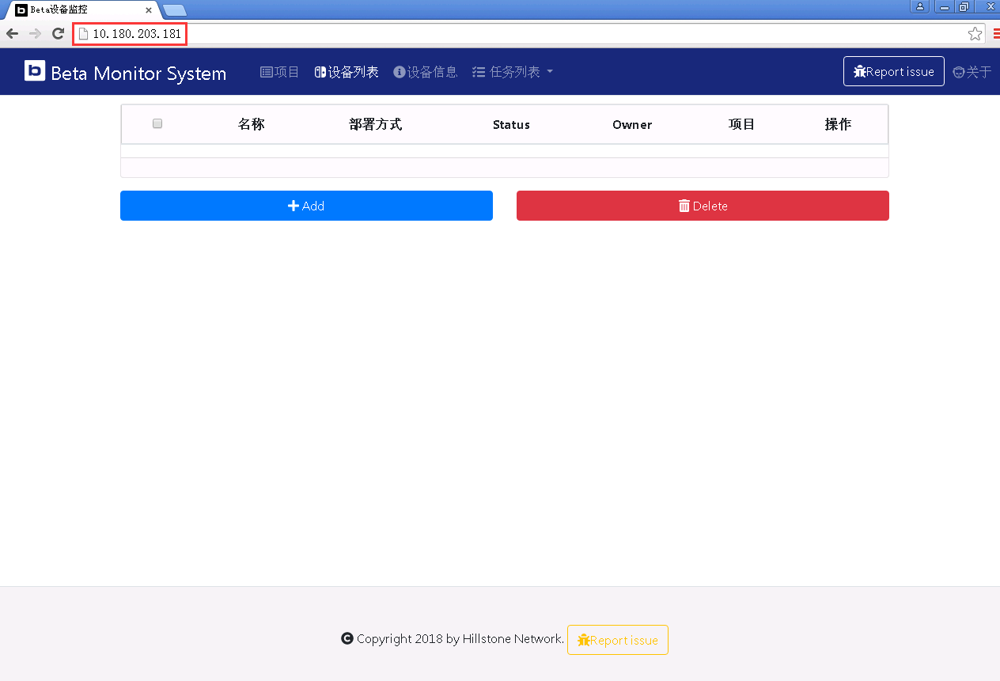 

***
***

__我们可以手动添加设备，点击Add：__

>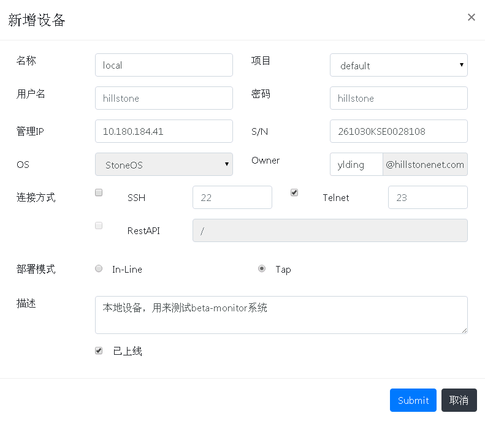

***
***

__添加后，该设备将会在设备列表页面显示，因为此时任务调度系统还未去设备上获取信息，所以该设备的状态显示为unknown。__

__我们可以点击操作的add task按钮后，将会立即调用任务调度程序，将其加入任务列表，从而去设备上获取信息。__

>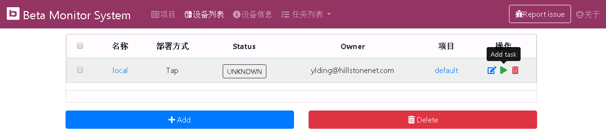

***
***

#### 项目

__项目页面显示项目的名称、描述、owner、该项目的beta设备数和操作，数据库中默认有一个default项目，显示如下：__

>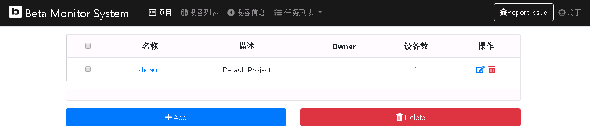

***
***

__我们可以手动添加项目，点击Add：__

>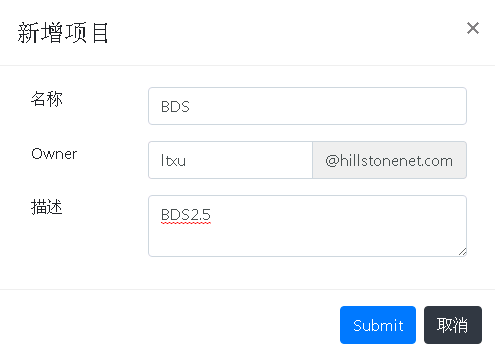

***
***

__添加后，该项目将会显示在项目列表中。__

>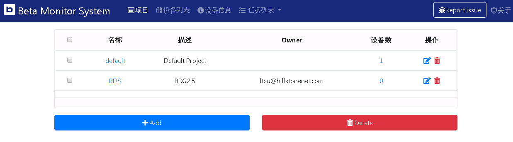

***
***

__我们可以将local设备的项目修改为BDS：__

>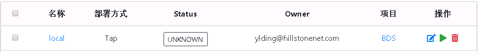

***
***


#### 设备信息

__设备信息页面将显示beta设备的详细信息列表：__

>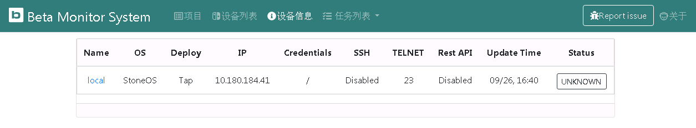

***
***

__点击设备name，将会显示该设备更加详细的信息，包括CPU、Memory、Session最近一天的趋势图，具体信息如下：__

>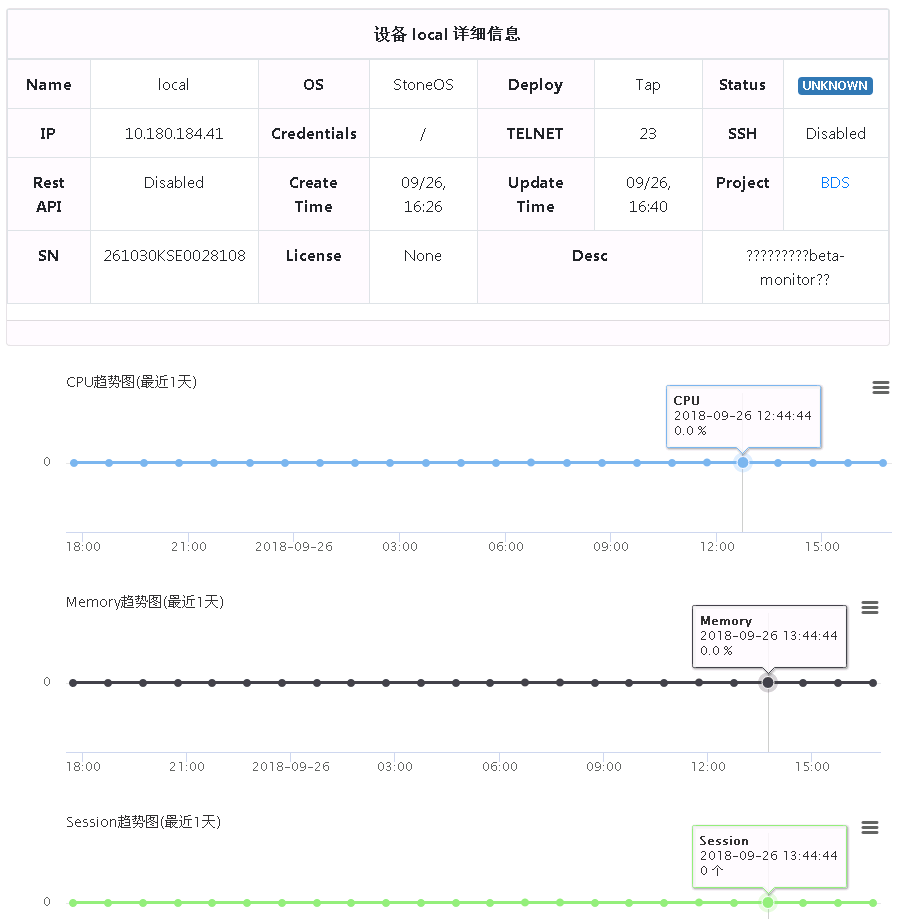

***
***


#### 任务列表

__任务列表可以显示当前任务和历史任务。__

>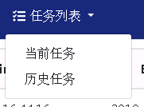

***
***

__当前任务显示所有当前正在执行和待执行的任务列表。__

>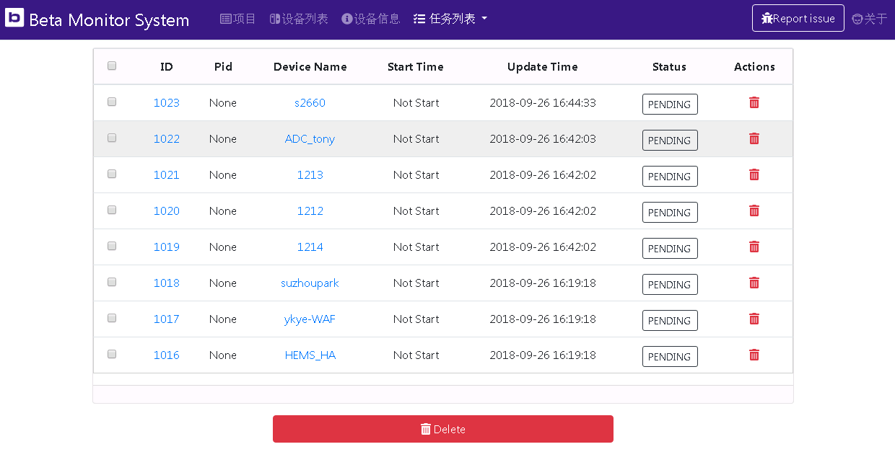

***
***

__历史任务显示已执行的任务列表：__

>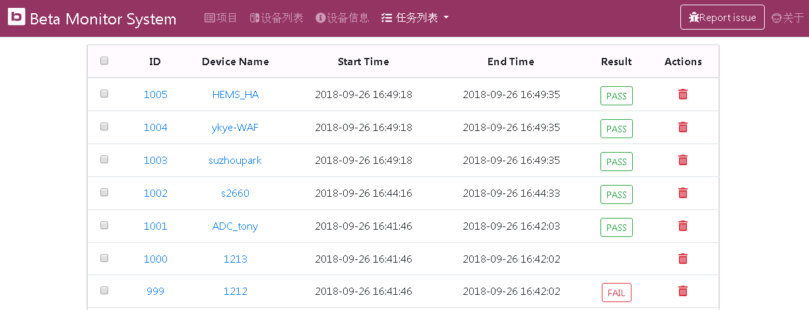

***
***


